# AI Engine — `detect_decide_verify`

> Stage đầy đủ của AIOps AI Engine: **Detect → Decide → Verify**.  
> Mục tiêu: AI Engine **đọc telemetry**, phát hiện anomaly/RCA, sinh **action plan**, và verify kết quả; **không trực tiếp mutate Kubernetes resources**.

---

## 1. Bức tranh tổng thể

```mermaid
flowchart LR
    CDO["CDO / Benchmark Client"] -->|POST /v1/detect| API["FastAPI Server\nsrc/server.py"]
    API --> TS{"telemetry_source?"}

    TS -->|benchmark_fixture| BF["Dataset Fixture\nai/ai-engine/dataset/<service_fault>/<run_id>"]
    TS -->|k8s| K8S["Kubernetes API\nPod Logs"]
    TS -->|k8s + prometheus| PROM["Prometheus HTTP API\nCPU / Memory Metrics"]
    TS -->|telemetry_window| BODY["Direct Telemetry Payload"]

    BF --> TEL["Telemetry Window"]
    K8S --> TEL
    PROM --> TEL
    BODY --> TEL

    TEL --> TP["TelemetryProcessor\nsrc/telemetry.py"]
    TP --> DET["BOCPD + EWMA\nsrc/anomaly_detector.py"]
    DET --> RCA["BARO RCA\nsrc/correlation_analyzer.py"]
    RCA --> DR["DetectResponse\nanomaly_context + service_top_k + LLM evidence"]

    DR -->|POST /v1/decide| DEC["SelfHealer\nsrc/self_healer.py"]
    DEC --> PLAN["Action Plan\nRunbook + Blast Radius + Verify Policy"]
    PLAN -->|Executor/CDO applies outside AI Engine| EXEC["K8s Executor / CDO"]
    EXEC -->|POST /v1/verify| VER["VerificationEngine\nsrc/verifier.py"]
    VER --> OUT{"DONE / RETRY / ROLLBACK / ESCALATE"}
```

---

## 2. Stage này làm gì?

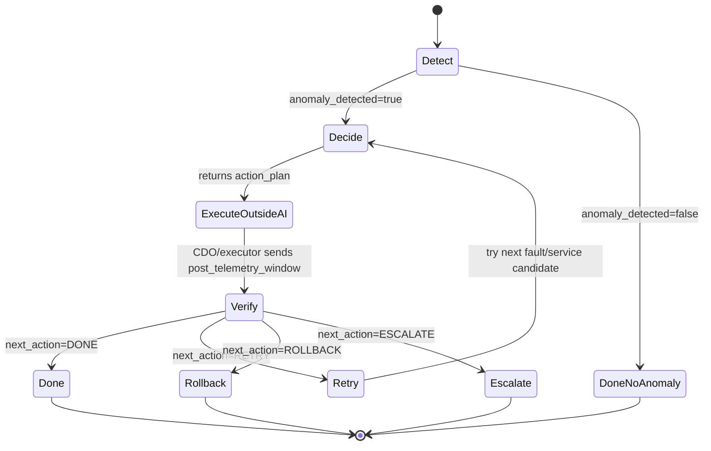

| Phase | Endpoint | Vai trò | File chính |
|---|---|---|---|
| Detect | `POST /v1/detect` | Đọc telemetry, BOCPD/EWMA anomaly, BARO RCA, trả `anomaly_context` | `src/server.py`, `src/engine.py`, `src/anomaly_detector.py`, `src/correlation_analyzer.py` |
| Decide | `POST /v1/decide` | Chọn runbook/action plan, optionally LLM rank fault type | `src/self_healer.py`, `src/engine.py` |
| Verify | `POST /v1/verify` | Đánh giá post-heal telemetry, trả `DONE/RETRY/ROLLBACK/ESCALATE` | `src/verifier.py` |
| Fault Rank | `POST /v1/fault-rank` | Rank fault catalog cho service cố định | `src/engine.py` |
| E2E benchmark | `scripts/benchmark_e2e.py` | Mô phỏng CDO gọi API thật | `scripts/benchmark_e2e.py` |

---

## 3. Luồng telemetry source

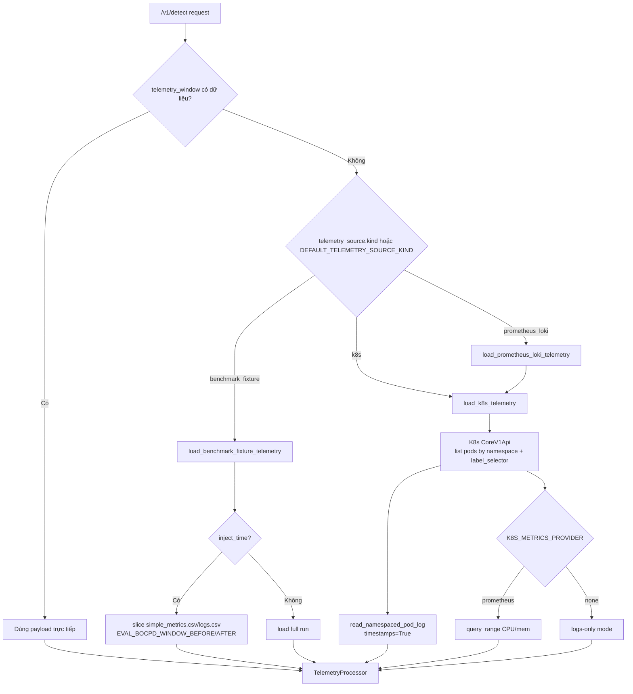

### Telemetry point chuẩn

```json
{
  "ts": "2024-01-15T21:34:46Z",
  "tenant_id": "benchmark-cdo",
  "service": "checkoutservice",
  "signal_name": "cpu",
  "value": 0.72,
  "labels": {"namespace": "production", "pod": "checkoutservice-xxx"}
}
```

Logs dùng:

```json
{
  "signal_name": "application_log_event",
  "value": "log message..."
}
```

---

## 4. Yêu cầu trước khi chạy

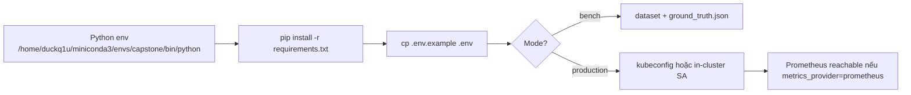

### Cài dependencies

```bash
cd ai/ai-engine/detect_decide_verify
/home/duckq1u/miniconda3/envs/capstone/bin/pip install -r requirements.txt
```

> Dependency đặc biệt cho production K8s: `kubernetes>=29.0.0`.

### Tạo `.env`

```bash
cd ai/ai-engine/detect_decide_verify
cp .env.example .env
```

### Compile check

```bash
cd ai/ai-engine/detect_decide_verify
/home/duckq1u/miniconda3/envs/capstone/bin/python -m py_compile \
  src/config.py \
  src/telemetry_sources.py \
  src/server.py \
  src/engine.py \
  scripts/benchmark_e2e.py
```


---

## 4.1. Yêu cầu các file JSON cấu hình kiến trúc

- `PLATFORM_PROFILE_PATH` là __bắt buộc nhất__ vì chứa service catalog, fault catalog, runbook mapping, runbooks, dependency graph.

- `PLATFORM_PROFILE_SCHEMA_PATH` nên có để validate profile trước deploy.

- `DEPENDENCY_GRAPH_PATH` hiện vẫn nên set vì một số analyzer legacy còn đọc file graph riêng; nội dung nên đồng bộ với `platform_profile.dependency_graph`.


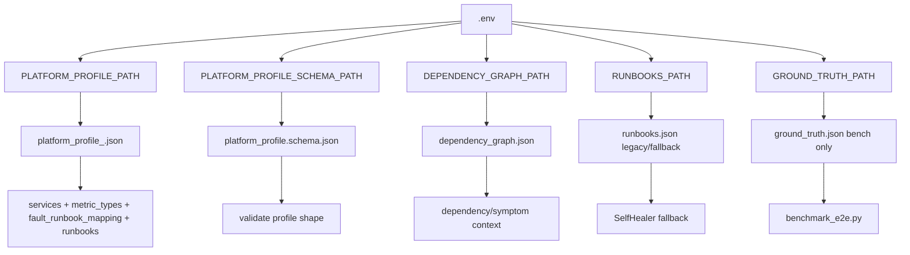

### 4.1.1 `PLATFORM_PROFILE_PATH` — file quan trọng nhất cho production

`PLATFORM_PROFILE_PATH` trỏ tới JSON profile của từng môi trường/CDO team. Đây là source-of-truth cho catalog runtime, thay vì hardcode trong `.env`.

| Field trong profile | Bắt buộc | Dùng cho |
|---|---:|---|
| `profile_name` | ✓ | Tên profile, ví dụ `online-boutique-prod` |
| `system` | ✓ | Trả về trong `anomaly_context.system` |
| `default_namespace` | ✓ | Namespace default cho action plan |
| `default_deployment_template` | ✓ | Render target dạng `deployment/{{target_service}}` |
| `default_service` | ✓ | Fallback service khi inference rỗng |
| `allowed_namespaces` | ✓ | Blast radius / namespace allow-list |
| `services` | ✓ | Danh sách service hợp lệ cho RCA/LLM |
| `metric_types` | ✓ | Danh sách fault type hợp lệ, ví dụ `cpu`, `mem`, `delay` |
| `fault_runbook_mapping` | ✓ | Map fault type → runbook key |
| `dependency_graph` | ✓ | Graph phụ thuộc service nhúng trong profile |
| `runbooks` | ✓ | Catalog runbook/action plan |

Ví dụ tối thiểu:

```json
{
  "profile_name": "online-boutique-prod",
  "system": "E-COMMERCE",
  "default_namespace": "production",
  "default_deployment_template": "deployment/{{target_service}}",
  "default_service": "checkoutservice",
  "allowed_namespaces": ["production"],
  "services": ["frontend", "checkoutservice", "paymentservice"],
  "metric_types": ["cpu", "mem", "delay", "loss", "socket", "disk"],
  "fault_runbook_mapping": {
    "cpu": "CPUSaturationRecoveryRunbook",
    "mem": "MemoryLeakRecoveryRunbook"
  },
  "dependency_graph": {
    "frontend": ["checkoutservice"],
    "checkoutservice": ["paymentservice"]
  },
  "runbooks": {
    "CPUSaturationRecoveryRunbook": {
      "name": "CPUSaturationRecoveryRunbook",
      "description": "Scale service when CPU saturation is detected.",
      "pattern_type": "urgent",
      "action_plan": [
        {
          "step": 1,
          "action": "SCALE_REPLICAS",
          "target": "deployment/{{target_service}}",
          "params": {"namespace": "production", "replicas": 3}
        }
      ],
      "blast_radius_config": {
        "max_pod_impact_pct": 25,
        "circuit_breaker_error_rate": 0.2,
        "allowed_namespaces": ["production"]
      },
      "verify_policy": {"window_seconds": 120, "success_conditions": ["pod_ready == true"]}
    },
    "MemoryLeakRecoveryRunbook": {
      "name": "MemoryLeakRecoveryRunbook",
      "description": "Patch memory limits when memory leak/OOM risk is detected.",
      "pattern_type": "urgent",
      "action_plan": [
        {
          "step": 1,
          "action": "PATCH_MEMORY_LIMIT",
          "target": "deployment/{{target_service}}",
          "params": {"namespace": "production", "container": "main", "memory_request_mb": 512, "memory_limit_mb": 1024}
        }
      ],
      "blast_radius_config": {
        "max_pod_impact_pct": 25,
        "circuit_breaker_error_rate": 0.2,
        "allowed_namespaces": ["production"]
      },
      "verify_policy": {"window_seconds": 120}
    }
  }
}
```

### 4.1.2 `PLATFORM_PROFILE_SCHEMA_PATH` — schema để kiểm tra profile

`platform_profile.schema.json` mô tả cấu trúc bắt buộc của `PLATFORM_PROFILE_PATH`.

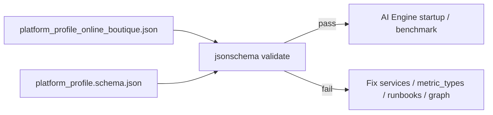

Lệnh validate profile:

```bash
cd ai/ai-engine/detect_decide_verify
/home/duckq1u/miniconda3/envs/capstone/bin/python - <<'PY'
import json
from jsonschema import Draft202012Validator
from src.config import PLATFORM_PROFILE_PATH, PLATFORM_PROFILE_SCHEMA_PATH
with open(PLATFORM_PROFILE_SCHEMA_PATH, 'r', encoding='utf-8') as f:
    schema = json.load(f)
with open(PLATFORM_PROFILE_PATH, 'r', encoding='utf-8') as f:
    profile = json.load(f)
errors = sorted(Draft202012Validator(schema).iter_errors(profile), key=lambda e: list(e.path))
if errors:
    for e in errors:
        print('FAIL', '.'.join(map(str, e.path)) or '<root>', '-', e.message)
    raise SystemExit(1)
print('PLATFORM_PROFILE_SCHEMA_VALID')
print('profile=', PLATFORM_PROFILE_PATH)
PY
```

### 4.1.3 `DEPENDENCY_GRAPH_PATH` — graph phụ thuộc service

`dependency_graph.json` là map `service -> list[related services]`, ví dụ:

```json
{
  "frontend": ["checkoutservice", "recommendationservice"],
  "checkoutservice": ["paymentservice", "cartservice"]
}
```

Hiện tại profile cũng có field `dependency_graph`. Có 2 cách vận hành:

| Cách | Env cần set | Khi nào dùng |
|---|---|---|
| Graph nhúng trong profile | `PLATFORM_PROFILE_PATH` | Khuyến nghị cho production để giảm số file rời |
| Graph file riêng | `DEPENDENCY_GRAPH_PATH` | Khi muốn benchmark/so sánh graph độc lập hoặc tái dùng chung |

> Lưu ý: code hiện vẫn đọc `DEPENDENCY_GRAPH_PATH` cho analyzer/correlation legacy. Vì vậy trong production nên **giữ `DEPENDENCY_GRAPH_PATH` trỏ tới một file graph nhỏ đồng bộ với profile**, hoặc generate file này từ `platform_profile.dependency_graph` trong pipeline deploy.

### 4.1.4 `RUNBOOKS_PATH`, `GROUND_TRUTH_PATH`, `DATASET_DIR`

| Env | Production có cần? | Bench có cần? | Ghi chú |
|---|---:|---:|---|
| `RUNBOOKS_PATH` | Không bắt buộc nếu `PLATFORM_PROFILE_PATH.runbooks` đầy đủ | Có thể dùng fallback | Stage ưu tiên load runbooks từ platform profile; file này là legacy/fallback |
| `GROUND_TRUTH_PATH` | Không | Có | Chỉ dùng cho benchmark/evaluate labels |
| `DATASET_DIR` | Không nếu đọc K8s/Prometheus | Có | Chỉ cần cho `benchmark_fixture` |

### 4.1.5 Production có phải chỉ set 2 path JSON không?

**Không.** Production không chỉ cần set `PLATFORM_PROFILE_SCHEMA_PATH` và `DEPENDENCY_GRAPH_PATH`.

Minimum production checklist nên là:

```env
# 1) Kiến trúc/catalog
PLATFORM_PROFILE_PATH=/app/config/platform_profile_prod.json
PLATFORM_PROFILE_SCHEMA_PATH=/app/config/platform_profile.schema.json
DEPENDENCY_GRAPH_PATH=/app/config/dependency_graph.json

# 2) Chế độ đọc telemetry runtime
TELEMETRY_RUNTIME_MODE=production
PRODUCTION_TELEMETRY_SOURCE_KIND=k8s
DEFAULT_TELEMETRY_SOURCE_KIND=

# 3) K8s logs source
K8S_NAMESPACE=production
K8S_IN_CLUSTER=True
K8S_LABEL_SELECTOR=app.kubernetes.io/part-of=online-boutique
K8S_SERVICE_LABEL_KEYS=app.kubernetes.io/name,app,service,k8s-app
K8S_LOG_SINCE_SECONDS=300
K8S_LOG_TAIL_LINES=500

# 4) Metrics source
K8S_METRICS_PROVIDER=prometheus
PROMETHEUS_BASE_URL=http://prometheus-server.monitoring.svc.cluster.local:9090
PROMETHEUS_QUERY_STEP_SECONDS=15
```

Nếu muốn tối giản file JSON, production cần ít nhất:

1. `PLATFORM_PROFILE_PATH` — **bắt buộc**, chứa services, metric_types, runbook mapping, runbooks, dependency_graph.
2. `PLATFORM_PROFILE_SCHEMA_PATH` — nên có để validate profile trước khi deploy.
3. `DEPENDENCY_GRAPH_PATH` — nên set vì code hiện vẫn đọc file graph riêng cho analyzer legacy; nội dung nên đồng bộ với `platform_profile.dependency_graph`.

Ngoài các path JSON, vẫn bắt buộc set nhóm env telemetry (`TELEMETRY_RUNTIME_MODE`, `K8S_*`, `PROMETHEUS_*`) để AI Engine biết đọc logs/metrics thật từ đâu.

### 4.1.6 Smoke test JSON paths

```bash
cd ai/ai-engine/detect_decide_verify
/home/duckq1u/miniconda3/envs/capstone/bin/python - <<'PY'
from src.config import (
    PLATFORM_PROFILE_PATH, PLATFORM_PROFILE_SCHEMA_PATH, DEPENDENCY_GRAPH_PATH,
    SERVICES_LIST, METRIC_TYPES_LIST, FAULT_TYPE_CATALOG, DEFAULT_NAMESPACE
)
print('PLATFORM_PROFILE_PATH=', PLATFORM_PROFILE_PATH)
print('PLATFORM_PROFILE_SCHEMA_PATH=', PLATFORM_PROFILE_SCHEMA_PATH)
print('DEPENDENCY_GRAPH_PATH=', DEPENDENCY_GRAPH_PATH)
print('DEFAULT_NAMESPACE=', DEFAULT_NAMESPACE)
print('SERVICES_LIST=', SERVICES_LIST)
print('METRIC_TYPES_LIST=', METRIC_TYPES_LIST)
print('FAULT_TYPE_CATALOG=', FAULT_TYPE_CATALOG)
PY
```


---

## 5. Chạy chế độ bench

### 5.1 `.env` cho bench

```env
TELEMETRY_RUNTIME_MODE=bench
BENCH_TELEMETRY_SOURCE_KIND=benchmark_fixture
PRODUCTION_TELEMETRY_SOURCE_KIND=k8s
DEFAULT_TELEMETRY_SOURCE_KIND=

DATASET_DIR=../dataset
GROUND_TRUTH_PATH=../dataset/ground_truth.json
EVAL_BOCPD_WINDOW_BEFORE=80
EVAL_BOCPD_WINDOW_AFTER=30
```

### 5.2 Start API server

```bash
cd ai/ai-engine/detect_decide_verify
USE_LLM_DECISION=False USE_LLM_FAULT_TYPE=False \
/home/duckq1u/miniconda3/envs/capstone/bin/python -m src.server
```

API mặc định:

```text
http://127.0.0.1:8050
```

### 5.3 Health check

```bash
curl -s http://127.0.0.1:8050/health | jq
curl -s http://127.0.0.1:8050/ready | jq
```

### 5.4 Chạy E2E benchmark API-driven

```bash
cd ai/ai-engine/detect_decide_verify
/home/duckq1u/miniconda3/envs/capstone/bin/python scripts/benchmark_e2e.py \
  --sample-size 1 \
  --top-k 3 \
  --api-url http://127.0.0.1:8050
```

Report output mặc định:

```text
ai/ai-engine/dataset/benchmark_reports/benchmark_e2e.json
```

### 5.5 Bench sequence

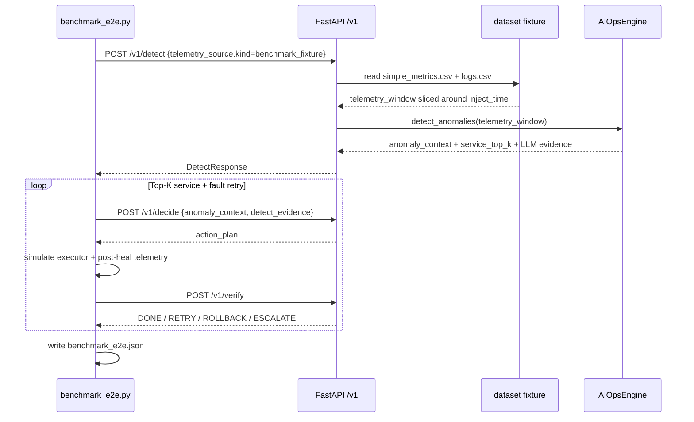

---

## 6. Chạy chế độ production K8s

### 6.1 `.env` production — chạy ngoài cluster bằng kubeconfig

```env
TELEMETRY_RUNTIME_MODE=production
PRODUCTION_TELEMETRY_SOURCE_KIND=k8s
DEFAULT_TELEMETRY_SOURCE_KIND=

K8S_NAMESPACE=production
K8S_CONTEXT=
K8S_IN_CLUSTER=False
K8S_LABEL_SELECTOR=app.kubernetes.io/part-of=online-boutique
K8S_SERVICE_LABEL_KEYS=app.kubernetes.io/name,app,service,k8s-app
K8S_CONTAINER_NAMES=
K8S_LOG_SINCE_SECONDS=300
K8S_LOG_TAIL_LINES=500

K8S_METRICS_PROVIDER=prometheus
K8S_METRIC_WINDOW_SECONDS=300
PROMETHEUS_BASE_URL=http://localhost:9090
PROMETHEUS_QUERY_STEP_SECONDS=15
PROMETHEUS_REQUEST_TIMEOUT_SECONDS=10
```

Port-forward Prometheus nếu chạy local:

```bash
kubectl -n monitoring port-forward svc/prometheus-server 9090:9090
```

### 6.2 `.env` production — chạy trong cluster

```env
TELEMETRY_RUNTIME_MODE=production
PRODUCTION_TELEMETRY_SOURCE_KIND=k8s
DEFAULT_TELEMETRY_SOURCE_KIND=

K8S_NAMESPACE=production
K8S_IN_CLUSTER=True
K8S_CONTEXT=
K8S_LABEL_SELECTOR=app.kubernetes.io/part-of=online-boutique

K8S_METRICS_PROVIDER=prometheus
PROMETHEUS_BASE_URL=http://prometheus-server.monitoring.svc.cluster.local:9090
```

### 6.3 RBAC tối thiểu cho AI Engine khi chạy in-cluster

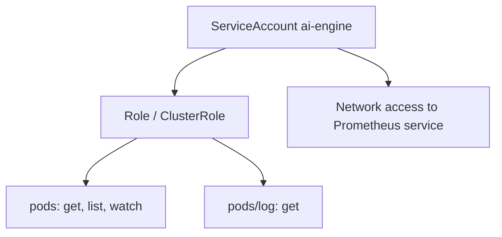

Ví dụ YAML:

```yaml
apiVersion: v1
kind: ServiceAccount
metadata:
  name: ai-engine
  namespace: production
---
apiVersion: rbac.authorization.k8s.io/v1
kind: Role
metadata:
  name: ai-engine-telemetry-reader
  namespace: production
rules:
  - apiGroups: [""]
    resources: ["pods"]
    verbs: ["get", "list", "watch"]
  - apiGroups: [""]
    resources: ["pods/log"]
    verbs: ["get"]
---
apiVersion: rbac.authorization.k8s.io/v1
kind: RoleBinding
metadata:
  name: ai-engine-telemetry-reader
  namespace: production
subjects:
  - kind: ServiceAccount
    name: ai-engine
    namespace: production
roleRef:
  kind: Role
  name: ai-engine-telemetry-reader
  apiGroup: rbac.authorization.k8s.io
```

### 6.4 Start API server production

```bash
cd ai/ai-engine/detect_decide_verify
/home/duckq1u/miniconda3/envs/capstone/bin/python -m src.server
```

### 6.5 Gọi `/v1/detect` production không gửi telemetry body lớn

```bash
curl -s -X POST http://127.0.0.1:8050/v1/detect \
  -H 'Content-Type: application/json' \
  -H 'X-Tenant-Id: production-cdo' \
  -H 'Authorization: Bearer local-dev' \
  -H 'X-Correlation-Id: 11111111-1111-4111-8111-111111111111' \
  -H 'Idempotency-Key: 22222222-2222-4222-8222-222222222222' \
  -H 'X-Dry-Run-Mode: true' \
  -d '{
    "correlation_id": "11111111-1111-4111-8111-111111111111",
    "idempotency_key": "22222222-2222-4222-8222-222222222222",
    "dry_run_mode": true,
    "telemetry_source": {
      "kind": "k8s",
      "namespace": "production",
      "label_selector": "app.kubernetes.io/part-of=online-boutique",
      "metrics_provider": "prometheus",
      "tenant_id": "production-cdo"
    }
  }' | jq
```

Nếu `.env` đã set production default, có thể bỏ `telemetry_source`:

```bash
curl -s -X POST http://127.0.0.1:8050/v1/detect \
  -H 'Content-Type: application/json' \
  -H 'X-Tenant-Id: production-cdo' \
  -H 'Authorization: Bearer local-dev' \
  -H 'X-Correlation-Id: 11111111-1111-4111-8111-111111111111' \
  -H 'Idempotency-Key: 22222222-2222-4222-8222-222222222222' \
  -H 'X-Dry-Run-Mode: true' \
  -d '{
    "correlation_id": "11111111-1111-4111-8111-111111111111",
    "idempotency_key": "22222222-2222-4222-8222-222222222222",
    "dry_run_mode": true
  }' | jq
```

---

## 7. Env đặc biệt trong `.env`

### 7.1 Telemetry source mode

| Env | Giá trị | Default | Khi nào dùng |
|---|---|---:|---|
| `TELEMETRY_RUNTIME_MODE` | `bench`, `production` | `bench` | Chọn default telemetry source theo môi trường |
| `BENCH_TELEMETRY_SOURCE_KIND` | `benchmark_fixture` | `benchmark_fixture` | Source mặc định cho benchmark |
| `PRODUCTION_TELEMETRY_SOURCE_KIND` | `k8s`, `prometheus_loki` | `k8s` | Source mặc định cho runtime thật |
| `DEFAULT_TELEMETRY_SOURCE_KIND` | empty hoặc source kind | empty | Nếu empty thì derive từ `TELEMETRY_RUNTIME_MODE`; nếu set thì override mode |

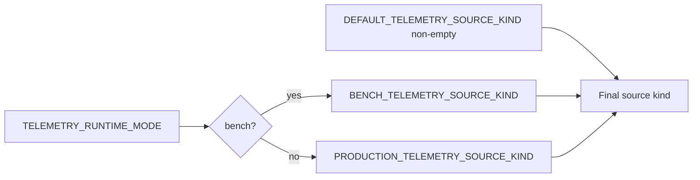

### 7.2 Benchmark fixture

| Env | Ý nghĩa |
|---|---|
| `DATASET_DIR` | Root dataset dùng cho fixture |
| `GROUND_TRUTH_PATH` | File labels benchmark |
| `EVAL_BOCPD_WINDOW_BEFORE` | Số giây lấy trước `inject_time` |
| `EVAL_BOCPD_WINDOW_AFTER` | Số giây lấy sau `inject_time` |
| `EVAL_BOCPD_BASELINE_LENGTH` | Baseline length dùng trong eval/benchmark |

Source shape:

```json
{
  "kind": "benchmark_fixture",
  "service_fault": "checkoutservice_cpu",
  "run_id": "1",
  "inject_time": 1705354566,
  "tenant_id": "benchmark-cdo"
}
```

### 7.3 Kubernetes logs

| Env | Default | Ghi chú |
|---|---:|---|
| `K8S_NAMESPACE` | `production` | Namespace đọc pod/log |
| `K8S_CONTEXT` | empty | Kubeconfig context; empty = current context |
| `K8S_IN_CLUSTER` | `False` | `True` khi AI Engine chạy trong cluster |
| `K8S_LABEL_SELECTOR` | empty | Filter pod list; nên set để tránh đọc quá rộng |
| `K8S_SERVICE_LABEL_KEYS` | `app.kubernetes.io/name,app,service,k8s-app` | Thứ tự label dùng map pod → service |
| `K8S_CONTAINER_NAMES` | empty | Empty = đọc tất cả container trong pod |
| `K8S_LOG_SINCE_SECONDS` | `300` | Chỉ đọc logs N giây gần nhất |
| `K8S_LOG_TAIL_LINES` | `500` | Giới hạn số dòng logs mỗi container |

### 7.4 Prometheus metrics

| Env | Default | Ghi chú |
|---|---:|---|
| `K8S_METRICS_PROVIDER` | `prometheus` | Hiện support `prometheus` hoặc `none` |
| `K8S_METRIC_WINDOW_SECONDS` | `300` | Query range window |
| `PROMETHEUS_BASE_URL` | cluster DNS example | URL Prometheus HTTP API |
| `PROMETHEUS_QUERY_STEP_SECONDS` | `15` | Step cho `/api/v1/query_range` |
| `PROMETHEUS_REQUEST_TIMEOUT_SECONDS` | `10` | Timeout HTTP request |

PromQL hiện query:

```promql
sum by (pod) (rate(container_cpu_usage_seconds_total{namespace="...",pod=~"...",container!="",image!=""}[1m]))
sum by (pod) (container_memory_working_set_bytes{namespace="...",pod=~"...",container!="",image!=""})
```

> Nếu cluster dùng metric names khác, cần chỉnh provider trong `src/telemetry_sources.py`.

### 7.5 LLM fault ranking

| Env | Default | Ghi chú |
|---|---:|---|
| `USE_LLM_DECISION` | `False` | Không nên bật khi benchmark deterministic |
| `USE_LLM_FAULT_TYPE` | `False` trong `.env.example` | Chỉ rank fault khi `detect_evidence.rank_fault_catalog_for_topk_service=True` |
| `LLM_PROVIDER` | `openai` | `openai`, `anthropic`, `bedrock` |
| `LLM_MODEL` | `gpt-4o` | Model theo provider |
| `OPENAI_API_KEY` / `ANTHROPIC_API_KEY` / AWS keys | empty | Không commit secret thật |

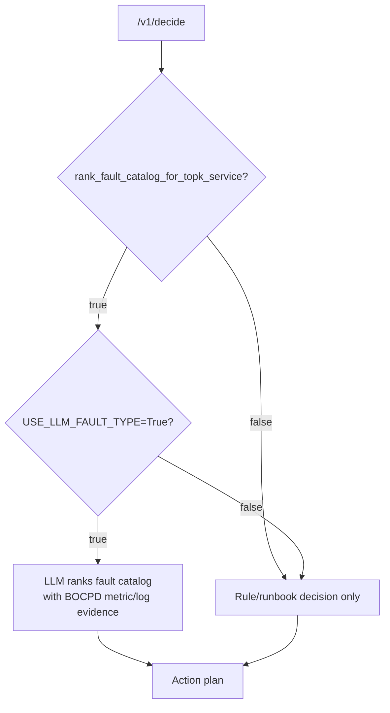

---

## 8. API payload mẫu

### 8.1 `/v1/detect` — bench fixture

```json
{
  "correlation_id": "11111111-1111-4111-8111-111111111111",
  "idempotency_key": "22222222-2222-4222-8222-222222222222",
  "dry_run_mode": true,
  "telemetry_source": {
    "kind": "benchmark_fixture",
    "service_fault": "checkoutservice_cpu",
    "run_id": "1",
    "inject_time": 1705354566,
    "tenant_id": "benchmark-cdo"
  }
}
```

### 8.2 `/v1/decide`

```json
{
  "correlation_id": "11111111-1111-4111-8111-111111111111",
  "idempotency_key": "33333333-3333-4333-8333-333333333333",
  "dry_run_mode": true,
  "anomaly_context": {
    "target_service": "checkoutservice",
    "suspected_fault_type": "cpu",
    "system": "E-COMMERCE",
    "namespace": "production",
    "deployment": "deployment/checkoutservice"
  },
  "detect_evidence": {
    "rank_fault_catalog_for_topk_service": true,
    "topk_service_rank": 1
  }
}
```

### 8.3 `/v1/verify`

```json
{
  "correlation_id": "11111111-1111-4111-8111-111111111111",
  "idempotency_key": "44444444-4444-4444-8444-444444444444",
  "dry_run_mode": true,
  "action_executed": {
    "action": "SCALE_REPLICAS",
    "target": "deployment/checkoutservice",
    "status": "COMPLETED",
    "execution_time_seconds": 45
  },
  "post_telemetry_window": [
    {
      "ts": "2026-06-30T06:00:00Z",
      "tenant_id": "production-cdo",
      "service": "checkoutservice",
      "signal_name": "service_error_rate",
      "value": 0.0,
      "labels": {}
    }
  ]
}
```

---

## 9. Troubleshooting nhanh

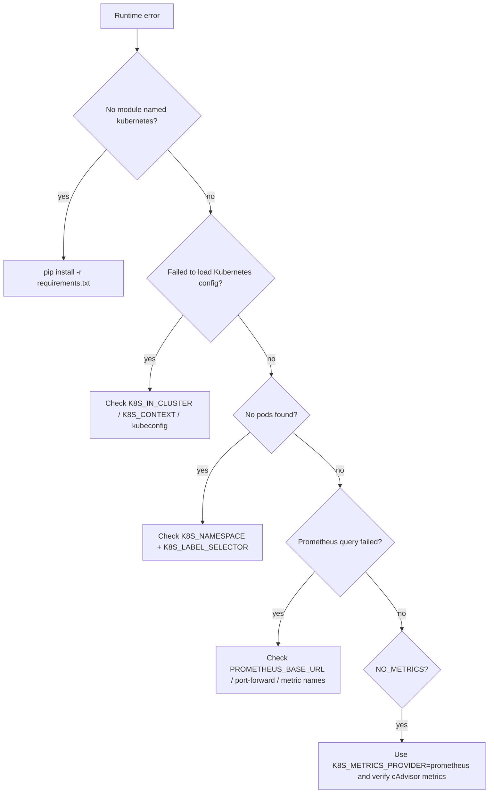

| Lỗi | Nguyên nhân thường gặp | Cách xử lý |
|---|---|---|
| `Kubernetes telemetry requires dependency 'kubernetes'` | Chưa cài Kubernetes Python client | `pip install -r requirements.txt` |
| `Failed to load Kubernetes config` | Sai `K8S_IN_CLUSTER`, thiếu kubeconfig/context | Check `kubectl config current-context`, set `K8S_CONTEXT` hoặc `K8S_IN_CLUSTER=True` |
| `No pods found` | Sai namespace/selector | `kubectl -n <ns> get pods --selector '<selector>'` |
| `PROMETHEUS_BASE_URL is required` | Metrics provider là `prometheus` nhưng URL rỗng | Set `PROMETHEUS_BASE_URL` hoặc `K8S_METRICS_PROVIDER=none` |
| `Prometheus query_range failed` | Prometheus không reachable / query metric không tồn tại | Port-forward hoặc chỉnh URL/metric names |
| `No metrics data found` | Logs-only hoặc Prometheus không trả series | Bật Prometheus metrics và kiểm tra cAdvisor/container metrics |

---

## 10. Lệnh kiểm tra hữu ích

### Kiểm tra env được load

```bash
cd ai/ai-engine/detect_decide_verify
/home/duckq1u/miniconda3/envs/capstone/bin/python - <<'PY'
from src.config import TELEMETRY_RUNTIME_MODE, DEFAULT_TELEMETRY_SOURCE_KIND, K8S_NAMESPACE, PROMETHEUS_BASE_URL
print('TELEMETRY_RUNTIME_MODE=', TELEMETRY_RUNTIME_MODE)
print('DEFAULT_TELEMETRY_SOURCE_KIND=', DEFAULT_TELEMETRY_SOURCE_KIND)
print('K8S_NAMESPACE=', K8S_NAMESPACE)
print('PROMETHEUS_BASE_URL=', PROMETHEUS_BASE_URL)
PY
```

### Smoke test benchmark fixture loader

```bash
cd ai/ai-engine/detect_decide_verify
/home/duckq1u/miniconda3/envs/capstone/bin/python - <<'PY'
import json
from src.telemetry_sources import load_telemetry_from_source
with open('../dataset/ground_truth.json', 'r', encoding='utf-8') as f:
    gt = next(iter(json.load(f).values()))
telemetry = load_telemetry_from_source({
    'kind': 'benchmark_fixture',
    'service_fault': gt['service_fault'],
    'run_id': gt['run_id'],
    'inject_time': gt.get('inject_time'),
    'tenant_id': 'benchmark-cdo',
})
print('telemetry_points=', len(telemetry))
print('first_point=', telemetry[0] if telemetry else None)
PY
```

### Smoke test K8s loader logs-only

```bash
cd ai/ai-engine/detect_decide_verify
/home/duckq1u/miniconda3/envs/capstone/bin/python - <<'PY'
from src.telemetry_sources import load_telemetry_from_source
telemetry = load_telemetry_from_source({
    'kind': 'k8s',
    'namespace': 'production',
    'label_selector': 'app.kubernetes.io/part-of=online-boutique',
    'metrics_provider': 'none',
    'tenant_id': 'smoke-test',
})
print('telemetry_points=', len(telemetry))
print('first_point=', telemetry[0] if telemetry else None)
PY
```

### Kiểm tra pod selector

```bash
kubectl -n production get pods --selector 'app.kubernetes.io/part-of=online-boutique'
```

### Kiểm tra Prometheus API

```bash
curl -s 'http://localhost:9090/api/v1/query?query=up' | jq
```

---

## 11. File map

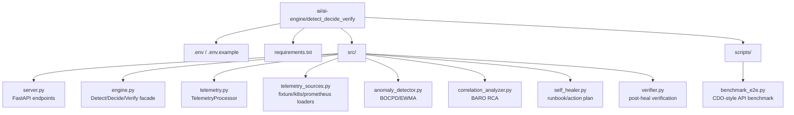

---

## 12. Nguyên tắc quan trọng

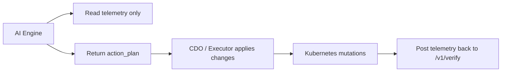

- Không hardcode service/fault catalog trong `.env`; dùng `PLATFORM_PROFILE_PATH`.
- Bench mode mặc định dùng fixture để reproducible.
- Production mode dùng selector/source; không gửi logs/metrics lớn trong body.
- LLM fault ranking chỉ gọi khi evidence yêu cầu explicit: `rank_fault_catalog_for_topk_service=True`.
