# Evidence Pack - CDO-02 TF3 (Final)

**Project:** TF3 Self-Heal Agent — CDO-02  
**Owner:** CDO-02  
**Date:** 2026-07-02  

---

## 1. Scope

Tài liệu này tổng hợp toàn bộ bằng chứng thực tế cho phần CDO platform của hệ thống TF3 Self-Heal triển khai trên AWS và EKS.

Phạm vi CDO-02 bao gồm:
- Hạ tầng EKS, VPC, Networking
- IAM IRSA tách biệt cho AI Engine và Executor
- Audit storage: S3 Object Lock + DynamoDB Idempotency
- CI/CD pipeline: GitHub Actions → ArgoCD
- Observability: CloudWatch Logs + Grafana
- Cost evidence: AWS Billing + Cost Explorer

---

## 2. Runtime Snapshot

| Hạng mục | Giá trị |
|---|---|
| AWS Account | `012619468490` |
| IAM Principal | `arn:aws:iam::012619468490:user/cdo02` |
| EKS Cluster | `cdo-eks-cluster-dev` |
| EKS Status | `ACTIVE` |
| Kubernetes Version | `1.30` |
| Region | `us-east-1` |
| Audit Bucket | `cdo-audit-012619468490-dev` |
| Object Lock | `Enabled` |
| Retention Mode | `GOVERNANCE` (sandbox — controlled deviation vs Compliance Mode) |
| Retention Days | `90` |

> Ghi chú: Governance Mode được chọn cho sandbox/capstone để có khả năng cleanup. Production nên dùng Compliance Mode + SSE-KMS key riêng.

---

## 3. EKS

### 3.1 EKS Cluster

Bằng chứng cluster `cdo-eks-cluster-dev` đã được tạo và đang ở trạng thái `Active`.

### 3.2 EKS Node Group

Bằng chứng node group đang chạy, worker nodes `t3.medium` đã sẵn sàng phục vụ tenant workloads.

---

## 4. Networking

### 4.1 VPC

Bằng chứng VPC riêng cho môi trường TF3 — tách biệt với hạ tầng khác.

### 4.2 Subnets

Bằng chứng public/private subnet đã cấu hình đúng, multi-AZ để đảm bảo HA.

---

## 5. IAM IRSA

IAM IRSA được cấu hình theo nguyên tắc least-privilege, tách biệt role cho từng component. Không có cross-component permission escalation.

### 5.1 AI Engine Role

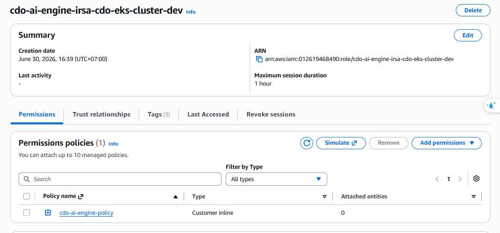

Bằng chứng IRSA role riêng cho AI Engine — chỉ có quyền đọc telemetry, không có Kubernetes API mutation.

### 5.2 Executor Role

Bằng chứng IRSA role riêng cho Executor — có quyền ghi S3 audit, đọc/ghi DynamoDB idempotency, thực hiện Kubernetes action trong namespace được phép.

---

## 6. Audit & Idempotency

### 6.1 S3 Object Lock

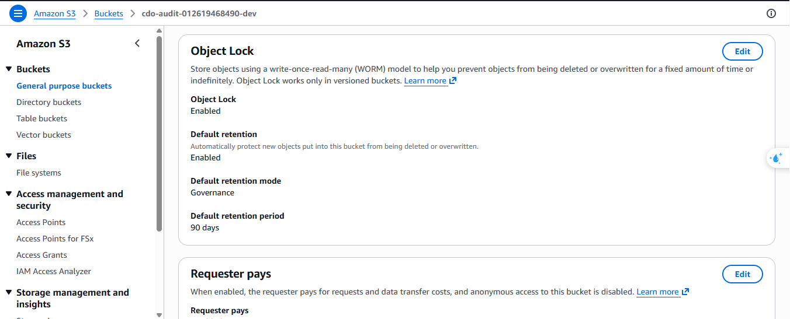

Bằng chứng Object Lock đã bật cho audit bucket — đảm bảo audit trail tamper-evident, không thể xóa/sửa trong retention period.

### 6.2 S3 Default Retention

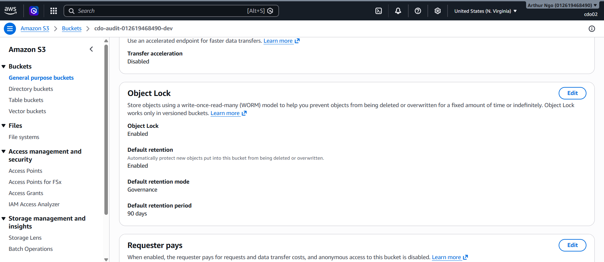

Bằng chứng default retention 90 ngày đã áp dụng cho bucket — đáp ứng yêu cầu audit lưu trữ tối thiểu.

### 6.3 S3 Audit Objects

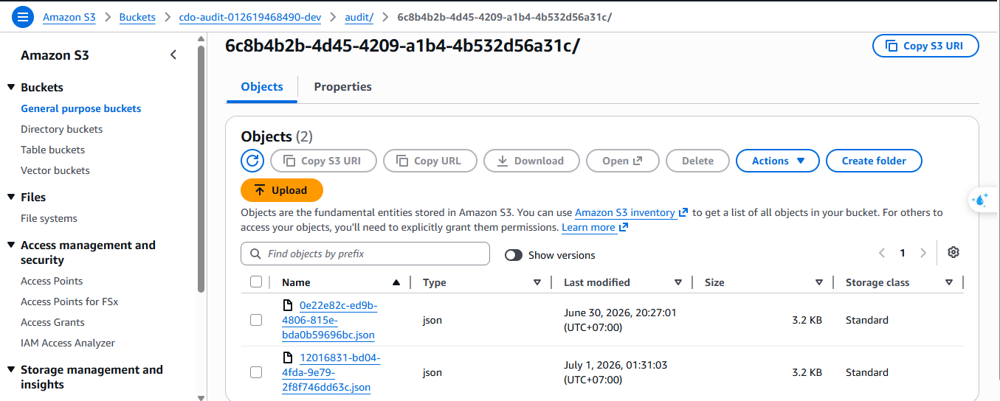

Bằng chứng audit objects đã được ghi vào S3 — mỗi object theo `correlation_id` của incident tương ứng.

### 6.4 DynamoDB Idempotency

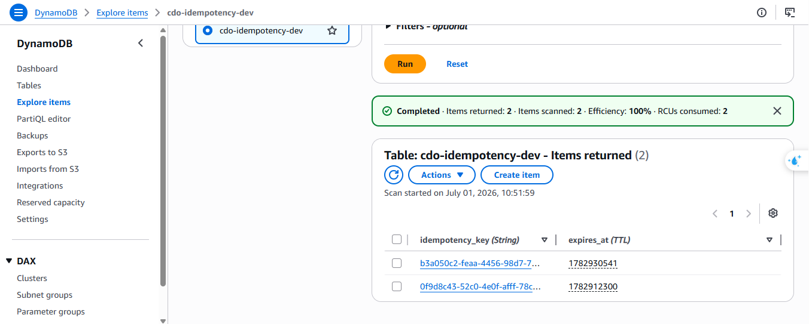

Bằng chứng bảng DynamoDB idempotency đã có dữ liệu. DynamoDB được dùng làm idempotency lock cho `/v1/decide` — ngăn duplicate execution với cùng `Idempotency-Key`.

---

## 7. Cost & Runtime

### 7.1 Billing Dashboard

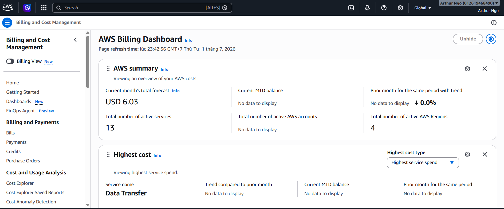

Bằng chứng AWS account đã phát sinh chi phí thực tế — xác nhận hạ tầng đã chạy thật, không phải mock.

### 7.2 Cost Explorer By Service

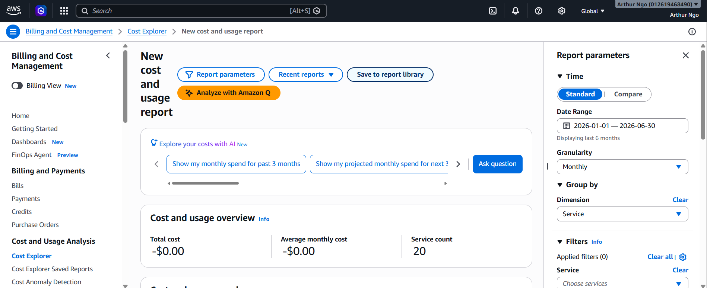

Bằng chứng cost breakdown theo nhóm service (EKS, EC2, S3, DynamoDB...).

### 7.3 Cost Explorer Table

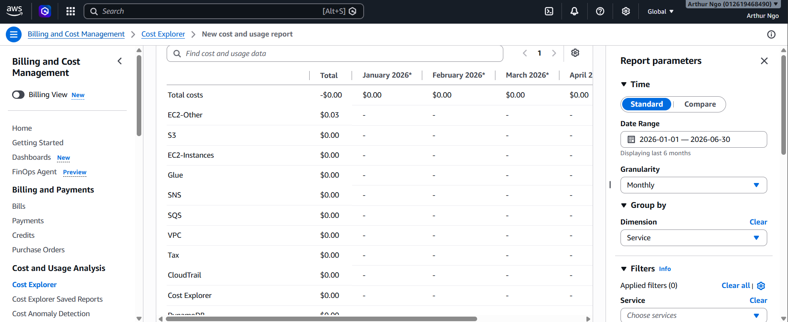

Bằng chứng bảng chi tiết cost theo từng service.

### 7.4 EC2 Instances

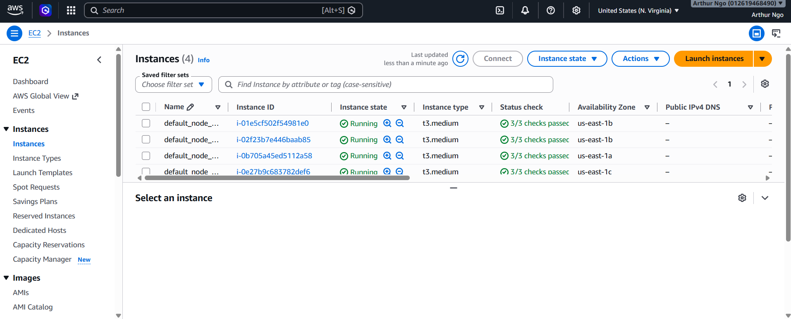

Bằng chứng worker nodes `t3.medium` đang ở trạng thái `Running` — xác nhận EKS node group hoạt động.

---

## 8. Observability

### 8.1 CloudWatch Logs Insights — SLO Query

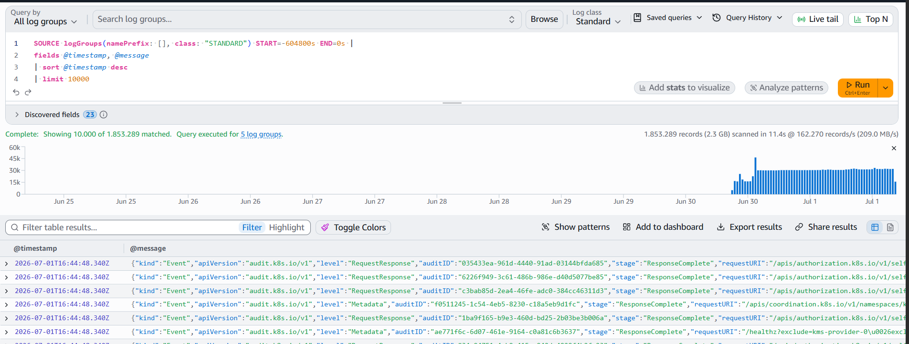

Bằng chứng CloudWatch Logs Insights query đang chạy trên log runtime của hệ thống — dùng để đo SLO và query theo `correlation_id`.

### 8.2 CloudWatch Correlation Trace

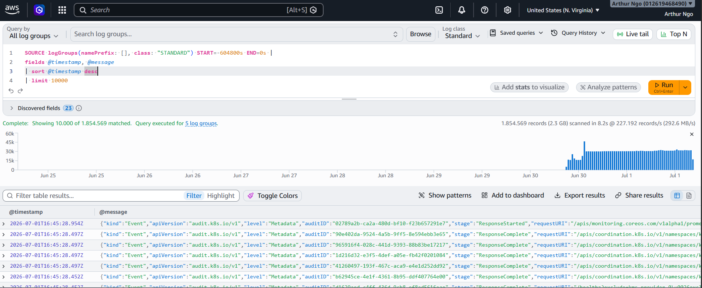

Bằng chứng trace audit theo `correlation_id` trong CloudWatch Logs — xác nhận toàn bộ incident chain có thể query được (detect → decide → safety → execute → verify).

### 8.3 Grafana Dashboard

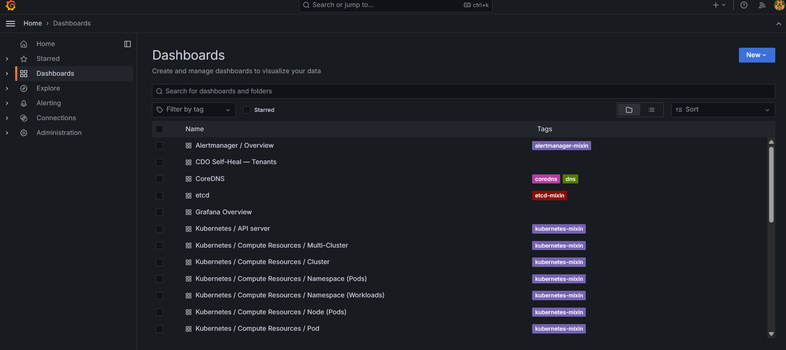

Bằng chứng Grafana đã lên UI và có dashboard TF3 Self-Heal — hiển thị metric runtime của hệ thống.

---

## 9. CI/CD

### 9.1 GitHub Actions Workflow

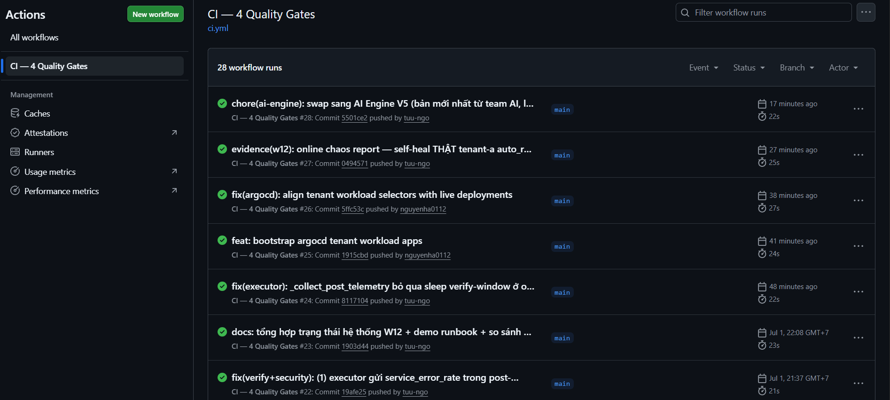

Bằng chứng GitHub Actions workflow đã chạy thành công — pipeline CI/CD build image, push lên ECR và trigger deploy lên EKS thông qua ArgoCD.

---

## 10. ArgoCD — GitOps

### 10.1 ArgoCD Dashboard

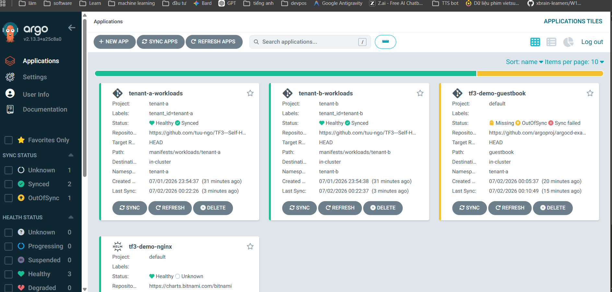

Bằng chứng ArgoCD đã lên UI và app tenant đang trạng thái `Synced` / `Healthy` — xác nhận GitOps deferred path hoạt động.

### 10.2 ArgoCD App Detail

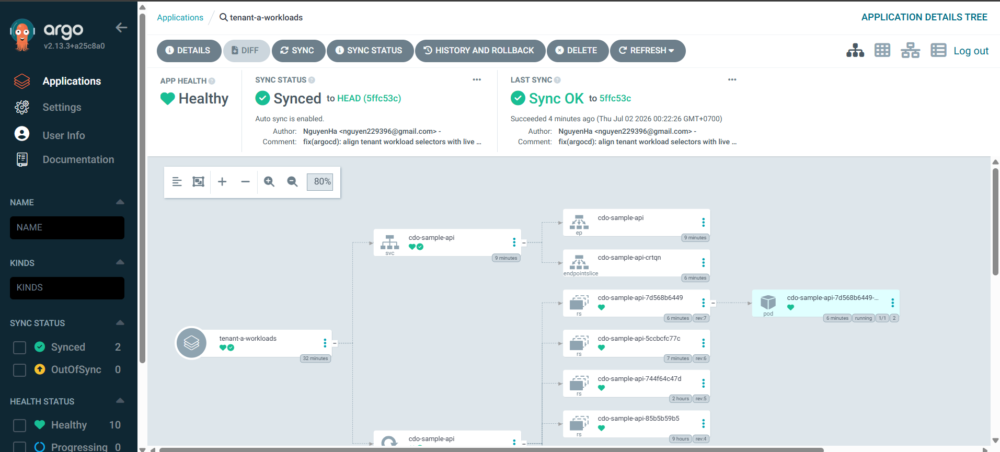

Bằng chứng resource tree của app trong ArgoCD đã xanh toàn bộ — tất cả K8s resources đã deploy đúng.

---

## 11. W12 Scenario Simulation

### 11.1 Offline 4h Scenario Test

Evidence file: [offline_4h_report.summary.log](./w12-scenario-sim/offline_4h_report.summary.log)

Bằng chứng W12 scenario simulation đã chạy offline 4h thành công. Report ghi nhận:
- `Rounds run`: 10633
- `Incidents injected`: 148862
- `Auto-resolved`: 106330/148862 = 71.4% (target >=60%)
- `Match expected`: 148862/148862
- `RESULT: PASS`

### 11.2 Online Chaos Report

Evidence file: [online_chaos_report.log](./w12-scenario-sim/online_chaos_report.log)

Bằng chứng online chaos đã chạy trên cluster thật với AI V4. Report ghi nhận:
- Tenant-a `cdo-sample-api`: crash `/panic` + incident → detect V4 → decide → safety 6/6 → restart thật → verify → `AUTO_RESOLVED`
- Round 2 và 3 trong cùng service dưới 5 phút được cooldown 5 phút chặn re-heal/flapping đúng thiết kế
- Tenant-b `notification-service`: safety gate chặn `DENIED_CROSS_TENANT`, bảo vệ tenant isolation đúng thiết kế

Kết luận W12: offline 4h PASS và online chaos chứng minh self-heal thật trên tenant-a, đồng thời xác nhận cooldown anti-flap và cross-tenant deny hoạt động đúng.

---

## 12. Tổng Kết Evidence

### 12.1 Hạ Tầng

| Hạng mục | Bằng chứng | Trạng thái |
|---|---|---|
| EKS Cluster Active | `eks-cluster-console.png` | ✅ |
| EKS Node Group Running | `eks-nodegroup.png` | ✅ |
| VPC riêng | `vpc-console.png` | ✅ |
| Public/Private Subnet multi-AZ | `subnets-console.png` | ✅ |
| EC2 Worker Nodes Running | `ec2-instances.png` | ✅ |

### 12.2 Security & Isolation

| Hạng mục | Bằng chứng | Trạng thái |
|---|---|---|
| IAM IRSA AI Engine (least-privilege) | `iam-irsa-ai.png` | ✅ |
| IAM IRSA Executor (least-privilege) | `iam-irsa-executor.png` | ✅ |

### 12.3 Audit & Idempotency

| Hạng mục | Bằng chứng | Trạng thái |
|---|---|---|
| S3 Object Lock Enabled | `s3-object-lock.png` | ✅ |
| S3 Retention 90 ngày (GOVERNANCE) | `s3-retention.png` | ✅ |
| S3 Audit Objects ghi được | `s3-audit-objects.png` | ✅ |
| DynamoDB Idempotency có dữ liệu | `dynamodb-items.png` | ✅ |

### 12.4 CI/CD & GitOps

| Hạng mục | Bằng chứng | Trạng thái |
|---|---|---|
| GitHub Actions pipeline thành công | `github-actions.png` | ✅ |
| ArgoCD Synced / Healthy | `argocd-dashboard.png` | ✅ |
| ArgoCD App Resource Tree xanh | `argocd-app-detail.png` | ✅ |

### 12.5 Observability & Cost

| Hạng mục | Bằng chứng | Trạng thái |
|---|---|---|
| CloudWatch Logs SLO Query | `slo-cwl-query.png` | ✅ |
| CloudWatch Correlation Trace | `cwl-correlation-trace.png` | ✅ |
| Grafana Dashboard | `grafana-dashboard-selfheal.png` | ✅ |
| Billing Dashboard (real cost) | `billing-dashboard.png` | ✅ |
| Cost Explorer By Service | `cost-explorer-by-service.png` | ✅ |
| Cost Explorer Table | `cost-explorer-table.png` | ✅ |

### 12.6 W12 Scenario Simulation

| Hạng mục | Bằng chứng | Trạng thái |
|---|---|---|
| Offline 4h scenario simulation | `w12-scenario-sim/offline_4h_report.summary.log` | ✅ PASS |
| Online chaos trên cluster thật | `w12-scenario-sim/online_chaos_report.log` | ✅ PASS |
| Cooldown anti-flap | `w12-scenario-sim/online_chaos_report.log` | ✅ |
| Cross-tenant safety deny | `w12-scenario-sim/online_chaos_report.log` | ✅ |

### 12.7 cost-by-usage

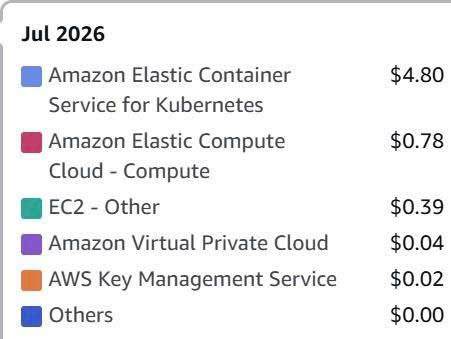

## 13. Acceptance Criteria Mapping

| Requirement (từ test report) | Evidence trong file này | Đánh giá |
|---|---|---|
| Hạ tầng EKS thật đã chạy | Section 3, 4, 7.4 | ✅ |
| IAM least-privilege, tách AI vs Executor | Section 5 | ✅ |
| Audit tamper-evident S3 Object Lock 90d | Section 6.1, 6.2 | ✅ |
| Audit objects được ghi theo correlation_id | Section 6.3, 8.2 | ✅ |
| DynamoDB idempotency lock tại /v1/decide | Section 6.4 | ✅ |
| CI/CD pipeline hoạt động | Section 9 | ✅ |
| GitOps deferred path (ArgoCD Synced) | Section 10 | ✅ |
| Observability runtime (CloudWatch + Grafana) | Section 8 | ✅ |
| Real cost evidence (không phải mock) | Section 7.1 | ✅ |
| W12 offline 4h scenario simulation PASS | Section 11.1 | ✅ |
| W12 online chaos trên cluster thật PASS | Section 11.2 | ✅ |
| Cooldown chống re-heal/flapping | Section 11.2 | ✅ |
| Cross-tenant deny bảo vệ tenant isolation | Section 11.2 | ✅ |
| Unsafe action = 0 (RBAC/Kyverno layer) | IAM IRSA tách biệt — Section 5 | ✅ (platform layer) |
